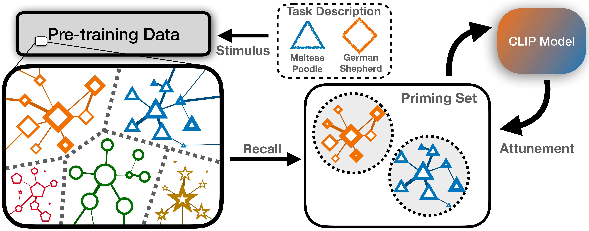
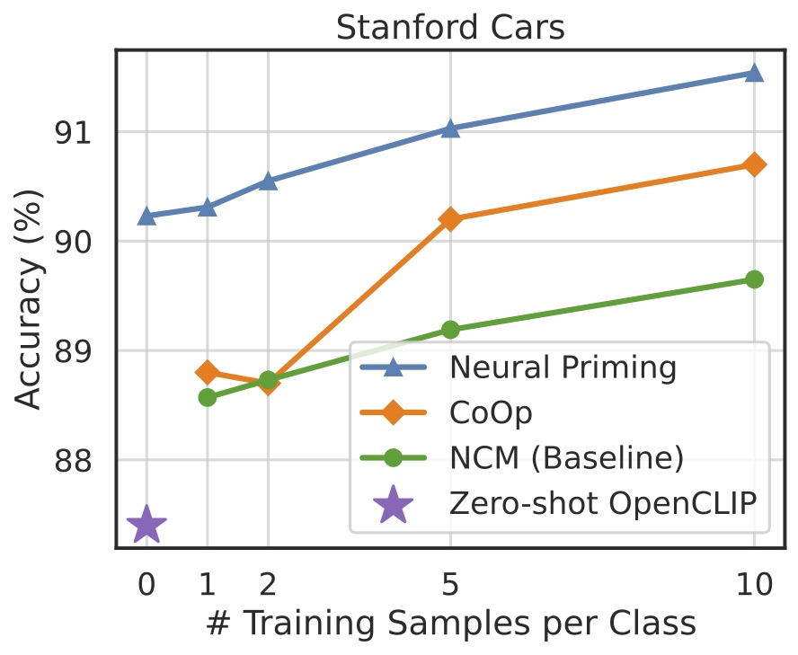
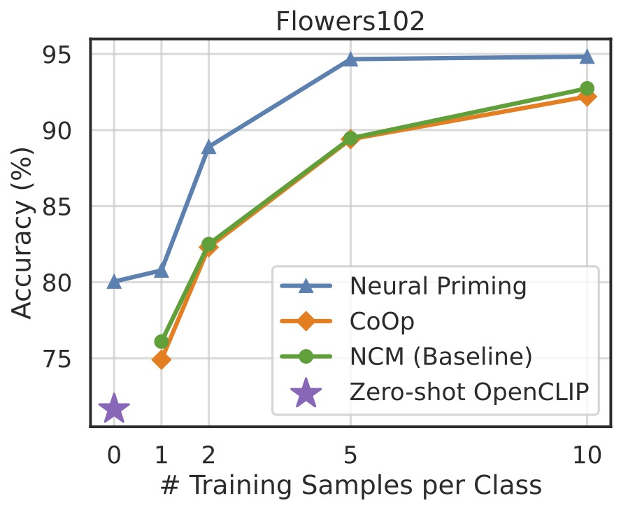

# Neural Priming

Pytorch implementation of [Neural Priming for Sample-Efficient Adaptation](https://arxiv.org/pdf/2306.10191.pdf). Improve transfer learning accuracy and robustness by recalling relevant data from the pretraining dataset. 




## Getting Started

### Installation

1. Clone this repository to your local machine using the following command:
  ```bash
  git clone https://github.com/your-username/neural-priming.git
  ```
3. Navigate to the project directory:
```bash
cd neural-priming
```
5. (Optional) - Create a conda environment:
```bash
conda create -n neural-priming-env python=3.8
```
6. Install the required dependencies from the requirements.txt file:
```bash
pip install -r requirements.txt
```

### Downloading The Data

#### Priming Data (LAION-2B)
To get started quickly we provide the priming subsets of LAION-2B for each target task. The link to download the data from Google Drive can be found [here](https://drive.google.com/drive/folders/1yQfr6IYrG8_ViuQW7hOtHHr6yalrQ8d0?usp=sharing). If downloading to a headless server we recommend using [gdown](https://github.com/wkentaro/gdown). Once downloaded, unzip and place in the `/data` folder in the root directory. 

Alternatively, we provide code in the **Text Filtering and Downloading Data** section for creating your own priming subset.  

#### Evaluation Data 

- To download ImageNet-1k: Download from this Kaggle [link](https://www.kaggle.com/competitions/imagenet-object-localization-challenge/data?select=ILSVRC). The validation and train set should be in ImageFolder format which looks like the following. 
```
├── ImageNet_Train
    ├── n01440764
        ├── img_1.jpeg
    ...
        ├── img_N.jpeg

    ...

    ├── n01632777
        ├── img_1.jpeg
    ...
        ├── img_N.jpeg
```


- Torchvision Datasets: The 6 transfer learning datasets (StanfordCars, FGVC Aircraft, Flowers102, OxfordPets, and SUN397) will automatically be downloaded upon running the training code. 

- The other datasets (ImageNetV2, ImageNet-a, r, and sketch) can be found on their respective webpages. For ImageNetV2 we use the *ImageNetV2-matched-frequency* version. 


## Train and Evaluate Models


### Zero-shot Priming
Example commands for priming and evaluating the model:
- ```python priming/prime.py --dataset Flowers102 --shots 0 --alpha .7 --prime --subset_path /data/Flowers102 --retrain```
- ```python priming/prime.py --dataset StanfordCars --shots 0 --prime --subset_path /data/StanfordCars --retrain```
- ```
  python priming/prime.py --dataset ImageNet --shots 0 --prime --cupl --subset_path /data/ImageNet --train_path /data/ImageNet/train --val_path /data/ImageNet/val --retrain
  ```
To run the equivalent baselines, omit the `--prime` flag. For example:

```python priming/prime.py --dataset Flowers102 --shots 0  --subset_path /data/Flowers102 --retrain```

Zero-shot Results:
|                         | ImageNet | Stanford Cars | FGVC Aircraft | Flowers102 | Food101 | Oxford Pets | SUN397 |
|-------------------------|----------|---------------|---------------|------------|---------|-------------|--------|
| CLIP Baseline            | 68.30    | 87.40         | 25.86         | 71.65      | 86.58   | 90.21       | 67.35  |
| CuPL             | 70.25    | 88.63         | 29.64         | 72.32      | 86.20   | 91.16       | 70.80  |
| Priming (Ours)          | 70.75    | 89.30         | 33.03         | 79.81      | 86.66   | 91.87   | 71.21  |
| Priming + CuPL (Ours)   | 71.38 | 90.23     | 36.00     | 80.04  | 86.86 | 91.85       | 72.35 |


### Few-shot Priming
Example commands for reproducing few-shot results. Note that alpha depends on the number of shots used. 

```bash
python priming/prime.py --dataset Flowers102 --shots 2 --alpha .58 --text --prime --subset_path /data/Flowers102 --retrain
```

```bash
python priming/prime.py --dataset FGVCAircraft --shots 3 --alpha .55 --text --prime --subset_path /data/FGVCAircraft --retrain
```

<div>
    
    
</div>


### Transductive Priming
Example commands for reproducing transductive results on the distribution shift datasets:


```bash
python priming/prime.py --dataset ImageNet-V2 --shots 0 --text --prime --cupl  --subset_path /data/ImageNetv2 --val_path /data/ImageNetV2-matched-frequency --custom_data --retrain
```

|                                      | ImageNet-V2 | ImageNet-R | ImageNet Sketch | ImageNet-A |
|--------------------------------------|-------------|------------|-----------------|------------|
| CLIP                          | 62.61       | 64.57      | 57.05           | 35.95      |
| Transduct. Priming (Ours)            |64.23   | 79.37  | 59.97       | 38.20  |


Command line options: 

- `--prime` Use the priming subset to condition the model.
- `--retrain` Reprocess the image features from the train/val/subset datasets. If already cached, omit to avoid reprocessing. 
- `--text` Initialize the classifier with the text prompts from OpenAI for ensembling with image features.
- `--cupl` Initialize the classifier with text prompts from CuPL and OpenAI.
- `--cache` Whether to cache the image features of the train/test/priming subset. Set to true by default. Set to false if low on disk space. 
- `--alpha` Ensembling coefficient between text and image features. Depends on the size of the training/priming set.
- `--shots` Number of examples to be used from the target training set (not to be confused with the priming subset).
- `--model` Change the base model. The priming subsets provided above are from the B-16 model.
- `--subset_path` Path to the priming subset.
- `--val_path` Path to the evaluation dataset. Only required for ImageNet and the distribution shift datasets. 


For full list of command line options see `args.py`. 


## Creating Custom Subsets from LAION-2B


### Text filtering and Downloading Images


### Transductive Filtering

